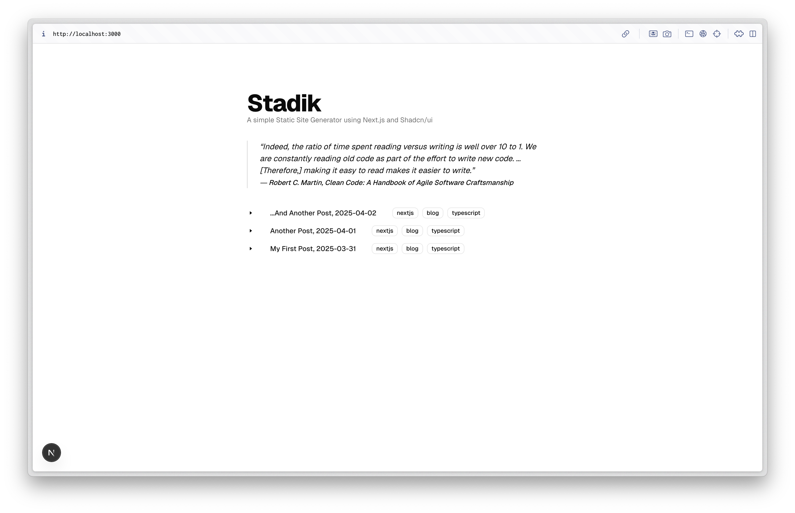
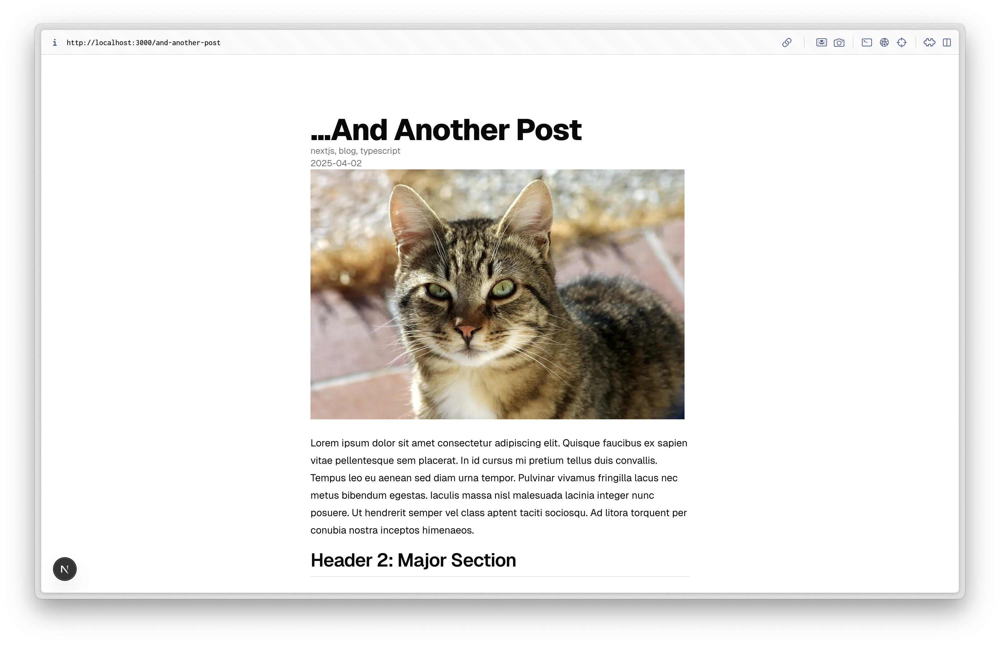

# Stadik
A simple static site generator where you can dynamically render your markdown files as blog posts. Based in Typescript and Next.js. Styled with shadcn/ui components.

#### Quickstart
1. `cd stadik`
2. `npm install`
3. `npm run dev`
    - `npm run build` & `npm run start`

#### Screenshots

Dynamically render your markdown files as a list of posts.

Parses and renders your markdown content.

---